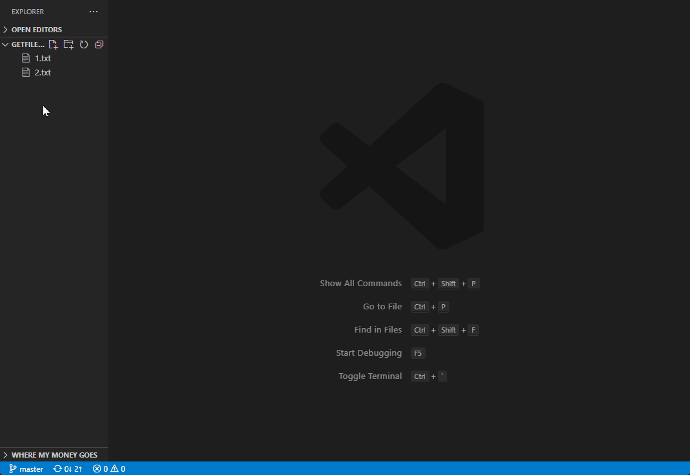
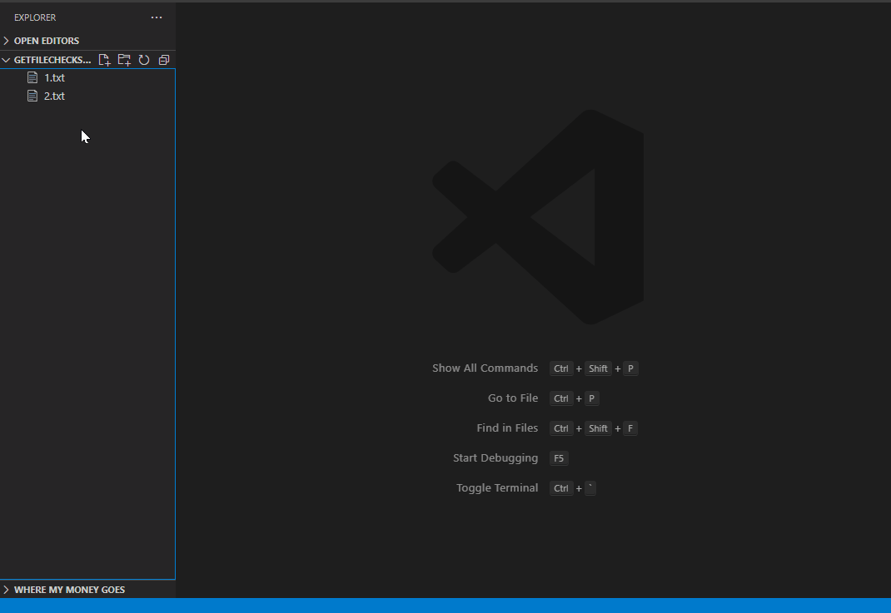
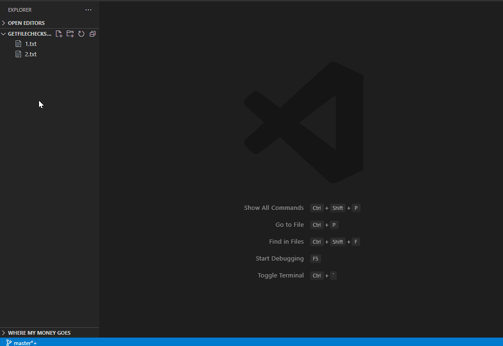

# get-file-checksum

## For single file:

- Under EXPLORER right click on the file
- Select one algorithm on "Get File Checksum"
- The file checksum value will copy on clipboard.
  

## For multiple files:

- Under EXPLORER select multiple files
- Right click on the one file and select one algorithm on "Get File Checksum"
- A file will popup on editor for all selected file's checksum.
  

## For keybinding:

- Keybinding support both single file and multiple files
- First go to settings.json to choose default algorithm for keybinding use
- Change keyboard shortcut if needed(default: ctrl(cmd) + alt + a)
  
  

### Supported algorithm:

- Checksum-8
- Checksum-16
- Checksum-32
- SHA-1
- SHA-256
- SHA-384
- SHA-512
- MD-5

### Under development:

- CRC-16
- CRC-32

### Reference

- All algorithm names refer to [HXD](https://mh-nexus.de/en/hxd/)
